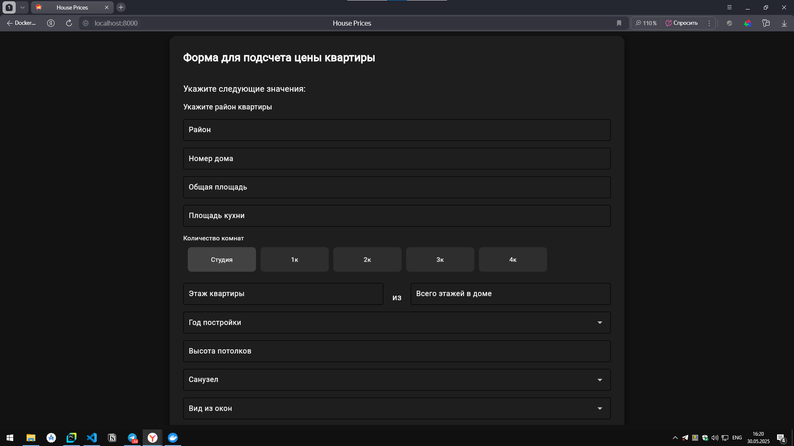

# HousePriceAPP
Веб-приложение для предсказания цены недвижимости по основным характеристикам при помощи градиентного бустинга


## Локальный запуск
Для загрузки образа используйте команду:
```
docker push artemchernobuk/house-price-app
```
Для запуска контейнера используйте команду:
```
run -d -p 8000:8000 artemchernobuk/house-price-app
```
> [!WARNING]
> Для запуска приложения используйте порты 8000, как указано в разделе "Локальный запуск"

## Инструменты и технологии

Для реализации проекта были использованы следующие инструменты и технологии:

### 1. Сбор и обработка данных

*   **Источник данных:** Сайт "Циан" (cian.ru) - использовался для получения информации об объектах недвижимости.
*   **Парсинг данных:**
    *   **Selenium:**  Библиотека Python для автоматизации взаимодействия с веб-сайтами, позволяющая извлекать данные с сайта "Циан".
    *   **Pandas:**  Библиотека Python для анализа и манипулирования данными, использовалась для структурирования и обработки собранных данных в DataFrame.

### 2. Машинное обучение и моделирование

*   **Обработка признаков:**
    *   **Target Encoding:**  Техника обработки категориальных признаков, направленная на повышение точности прогнозов.
*   **Основной алгоритм:**
    *   **Градиентный бустинг:**  Использован в качестве основного алгоритма для построения модели прогнозирования.
*   **Оптимизация модели:**
    *   **Optuna:**  Фреймворк Python для автоматической оптимизации гиперпараметров, использовался для подбора оптимальных параметров модели градиентного бустинга.
*   **Оценка модели:**
    *   **K-блочная кросс-валидация:**  Метод оценки производительности модели, обеспечивающий более надежную оценку её точности.
*   **Метрика оценки:**
    *   **PMSE (Root Mean Square Error - RMSE):**  Метрика оценки качества регрессионной модели.

### 3. Разработка программного обеспечения

*   **Язык программирования:**
    *   **Python:**  Основной язык разработки.
*   **Web-интерфейс:**
    *   **Flet:**  Фреймворк Python для быстрого создания веб-интерфейсов.
*   **База данных:**
    *   **SQLite:**  Система управления базами данных для хранения запросов и мониторинга модели.
*   **Контейнеризация и развертывание:**
    *   **Docker:**  Платформа контейнеризации для упрощения развертывания приложения.
    *   **Docker Hub:**  Репозиторий для хранения и распространения Docker образов.
